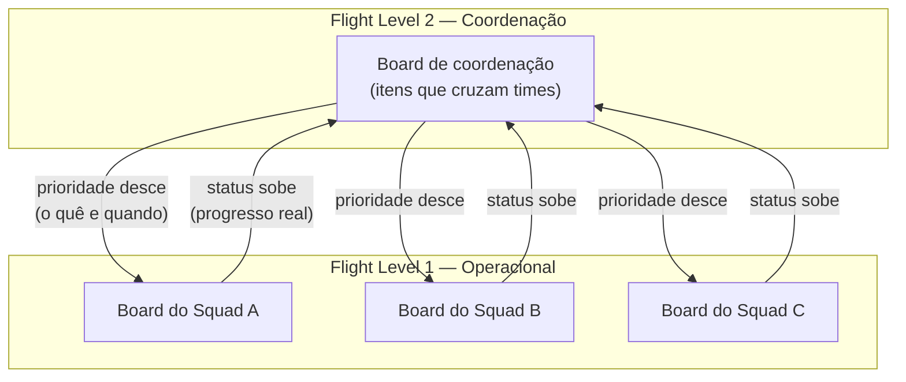

# 03 — Design do nível 2

> O coração do estudo de caso. Como o sistema de coordenação foi desenhado: quais itens viviam no board, qual caminho percorriam e como a visibilidade de ponta a ponta foi construída.

## O ponto de partida do design

A primeira decisão foi resistir à tentação de criar "mais um board de tarefas". O nível 2 não duplica o que os times já fazem no nível 1. Ele opera num nível de abstração acima: coordena entregas e iniciativas que atravessam vários times, não as tarefas internas de cada um.

A pergunta que guiou o desenho foi simples: *o que precisa ser coordenado entre os times para o valor fluir de ponta a ponta?* Tudo que era interno a um único time ficou no FL1. Tudo que cruzava fronteiras subiu para o FL2.

## Flight items: o que vivia no board de coordenação

No nível 2, os itens não eram tarefas, e sim unidades de valor que dependiam de mais de um time para serem entregues.

> 📝 **[PREENCHER]:** descreva o que eram seus flight items na prática. Eram épicos? Iniciativas de produto? Entregas que cruzavam squads? Dê um exemplo genérico e anonimizado de um item típico, para o leitor entender o nível de granularidade.

A granularidade certa é a parte mais delicada do design. Item grande demais esconde o progresso (fica "em andamento" por meses); item pequeno demais polui o board de coordenação com o que deveria estar no nível do time. O equilíbrio que busquei foi o item representar uma entrega de valor coordenada — algo que a liderança de produto e engenharia precisava acompanhar de ponta a ponta.

## Flight routes: o caminho de uma entrega

Cada item percorria um fluxo visível, das primeiras definições até a entrega. As colunas do board representavam os estágios desse caminho.

> 📝 **[PREENCHER]:** liste as colunas/estágios reais do seu board de coordenação. Um exemplo comum de fluxo FL2 seria: Opções/Backlog → Em definição → Pronto para iniciar → Em desenvolvimento (entre times) → Em validação → Concluído. Ajuste para o que você realmente usou.

O board ficava visível para a liderança de produto e de engenharia, o que respondia diretamente ao problema original: pela primeira vez existia um único lugar onde se enxergava o fluxo de valor inteiro, e não pedaços isolados em cada time.

## A arquitetura: conectando o nível 2 ao nível 1

O nível 2 não substituía os boards dos times — conectava-se a eles. Um item de coordenação no FL2 se desdobrava em trabalho concreto nos boards de FL1 dos squads envolvidos. O status subia dos times para o board de coordenação; a priorização descia do board de coordenação para os times.

> 📝 **[PREENCHER]:** ajuste o número de squads e os nomes genéricos (Squad A, B, C...) conforme sua realidade. Se quiser, troque por nomes funcionais anonimizados (ex.: "Squad de Onboarding", "Squad de Core").

## A decisão mais importante de design

Manter o board de coordenação **enxuto**. A tentação constante era adicionar mais detalhe, mais colunas, mais itens — até o board virar uma réplica inflada dos boards de time. Cada vez que isso ameaçava acontecer, a pergunta de controle era: *isto precisa ser coordenado entre times, ou é trabalho interno de um time só?* Se fosse interno, descia para o FL1.

Essa disciplina foi o que manteve o nível 2 útil. Um board de coordenação que tenta mostrar tudo deixa de coordenar qualquer coisa.

A próxima seção trata do que faz o board respirar: as cadências.
