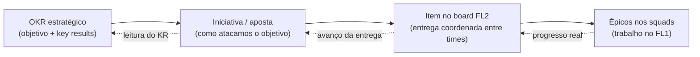

# 05 — De OKRs a entregas

> A parte que conecta os dois extremos: como um objetivo estratégico no topo virava trabalho concreto no board de um time, e como o progresso desse trabalho voltava a informar a estratégia. É a "flight route" completa, do OKR ao épico.

## O problema do elo perdido

OKRs costumam morrer num limbo. A diretoria define objetivos ambiciosos; os times trabalham duro nas suas tarefas; e no meio existe um vão onde ninguém consegue dizer com clareza *como* o trabalho dos times move os objetivos. O resultado é o sintoma clássico: OKRs que viram quadro na parede e times que entregam features sem saber a qual objetivo servem.

O nível 2 foi exatamente a ponte sobre esse vão. Ele deu um lugar onde a estratégia se traduzia em entregas coordenadas, e onde o progresso das entregas se traduzia de volta em leitura de avanço dos objetivos.

## A cadeia de tradução

A conexão funcionava como uma cadeia, de cima para baixo e de volta:

A leitura de baixo para cima é o que tornava o sistema honesto: o avanço real dos épicos nos times informava o quanto a entrega coordenada progredia, que por sua vez mostrava o quanto a iniciativa estava de fato movendo o key result. Sem inventar percentuais — o progresso vinha do trabalho real, não de uma estimativa otimista em planilha.

> 📝 **[PREENCHER]:** dê um exemplo anonimizado e completo da cadeia, do topo à base. Algo como: "Objetivo: [genérico]. KR: [genérico]. Iniciativa: [genérica]. Item de coordenação: [genérico]. Épicos nos times: [genéricos]." Um exemplo concreto vale mais que toda a explicação abstrata.

## O que conectava, na prática

A tradução não era automática. Acontecia nas cadências (seção 04), em dois momentos:

Na **cadência de priorização**, as iniciativas vindas dos OKRs eram transformadas em itens do board de coordenação e priorizadas. Era o ponto em que a estratégia descia para o nível executável.

Na **cadência de visibilidade para a liderança**, o progresso dos itens subia, dando à liderança de produto e engenharia uma leitura realista de quanto os objetivos estavam avançando — baseada em entrega, não em promessa.

> 📝 **[PREENCHER]:** se você usava alguma ferramenta para sustentar essa conexão (board físico, ferramenta digital, planilha de apoio), mencione de forma genérica. Evite citar nomes que identifiquem o ambiente, se preferir manter o sigilo total.

## Por que isso importava para a liderança

Antes, a pergunta "como estamos em relação ao objetivo?" recebia respostas baseadas em percepção. Depois, a mesma pergunta tinha uma resposta ancorada no fluxo real de entregas. Essa mudança — de percepção para evidência — foi o que deu à liderança confiança para decidir onde investir e onde corrigir o curso.

É também o que torna esse tipo de trabalho valioso de descrever em uma entrevista: não é "implementei Flight Levels", é "construí a linha de visão entre a estratégia e a entrega, e isso mudou como a liderança decidia".

A próxima seção trata de como medimos se tudo isso estava funcionando.
