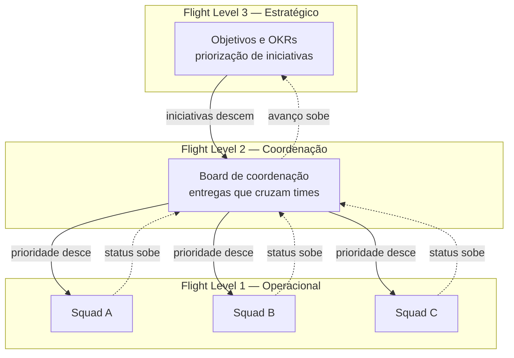
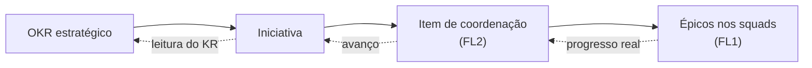
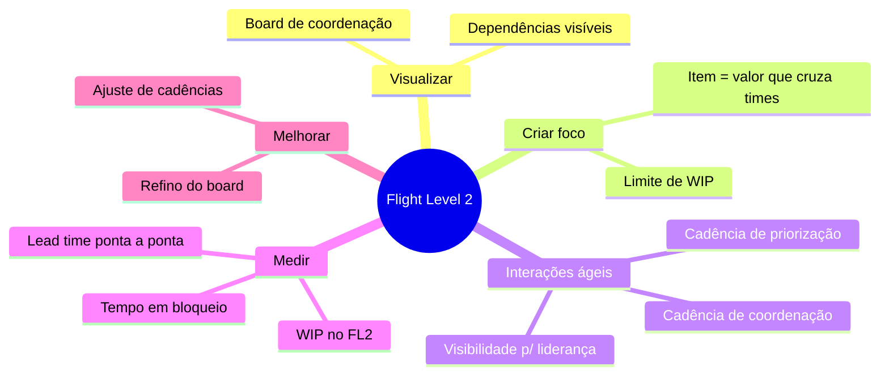

# Diagramas — Arquitetura Flight Levels

> Os diagramas do estudo de caso reunidos em um lugar, em Mermaid (renderiza nativamente no GitHub). Reutilize e adapte.

## Visão geral dos três níveis

> 📝 **[PREENCHER]:** ajuste o número de squads à sua realidade.

## A flight route: do OKR ao épico

## As cinco atividades aplicadas ao nível 2

## Como usar estes diagramas

Cole o bloco Mermaid correspondente no documento onde fizer sentido, ou mantenha este arquivo como referência visual central do repositório. No GitHub, os diagramas Mermaid renderizam automaticamente — não é preciso gerar imagens.

> 📝 **[PREENCHER]:** se quiser personalizar, substitua "Squad A/B/C" por nomes funcionais anonimizados que reflitam a sua estrutura (ex.: "Squad de Core", "Squad de Integrações"), mantendo o sigilo sobre a empresa.
